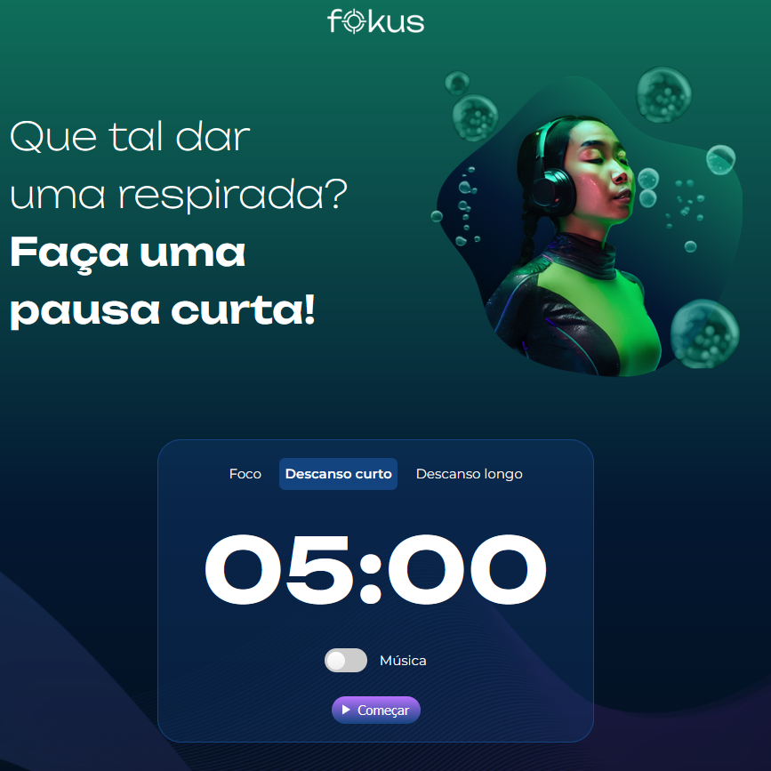
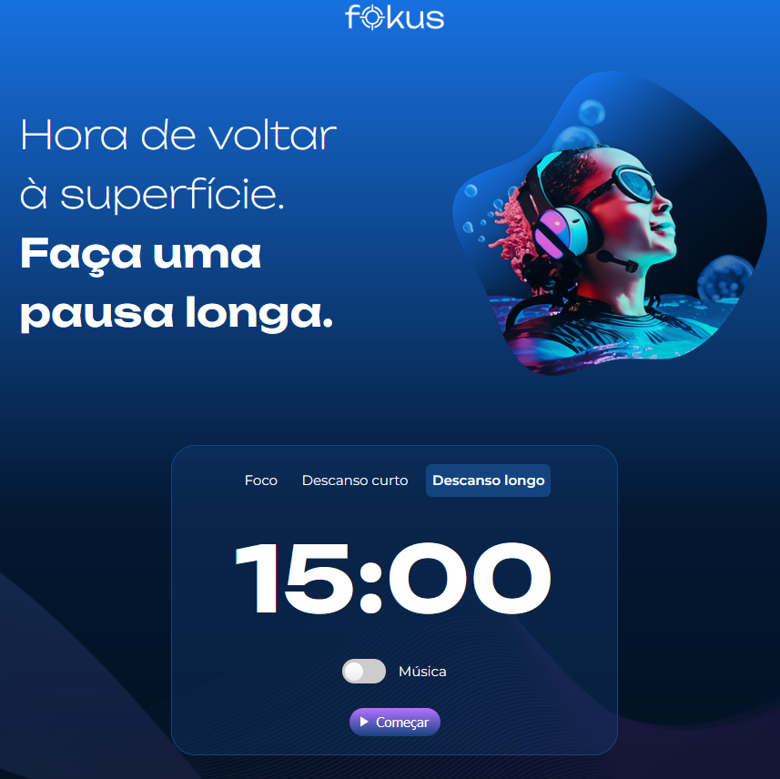
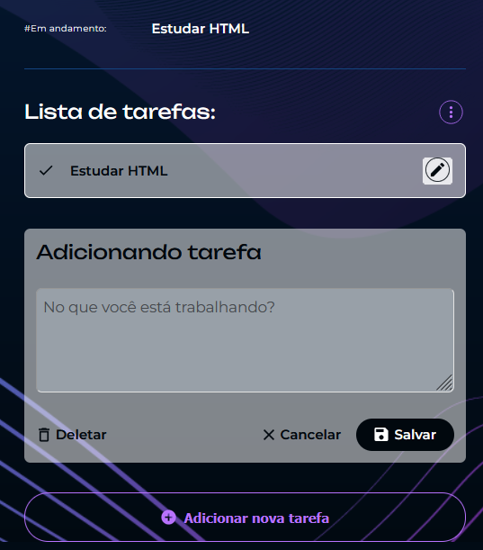

## ⏱️ Fokus

O **Fokus** é uma aplicação de gerenciamento de tempo baseada na técnica **Pomodoro**. Possui três opções de temporizador: **foco (25 min.), descanso curto (5 min.) e descanso longo (25 min.)**. A interface é interativa e dinâmica, mudando cor e imagem de fundo conforme o modo selecionado. Também é possível adicionar e remover tarefas que serão realizadas durante os ciclos de foco.

 

## 🚀 Sobre o Projeto

Este projeto foi desenvolvido durante o curso da Alura:

* "JavaScript: manipulando elementos no DOM"

Com o **Fokus**, houve o uso de **JavaScript para manipulação do DOM**, interações com eventos, controle de estados, alteração de atributos, estilos e criação de funcionalidades completas em uma página HTML.

## 📚 Objetivos do Curso

* Construir uma aplicação de temporizador estilo **Pomodoro** do zero;
* Conhecer na prática métodos de **manipulação de elementos no DOM**, como estilos CSS, imagens e textos;
* Alterar **atributos e classes** de forma dinâmica com JavaScript;
* Criar **eventos** de interação com a pessoa usuária;
* Utilizar **objetos utilitários** do JavaScript.

## 🛠️ Tecnologias Utilizadas

## 🖼️ Visualização do Projeto

Uma prévia das principais funcionalidades do **Fokus**:

**🌐 Acesse o Projeto Online**

O projeto está disponível para visualização na **Vercel**. Clique no link abaixo para acessar:

**🎯 Temporizador Pomodoro**

Temporizador com modo de foco e pausas. As cores e imagens de fundo mudam conforme a seleção.

**✅ Lista de Tarefas**

Campo para adicionar tarefas e opção de excluir cada item da lista.

